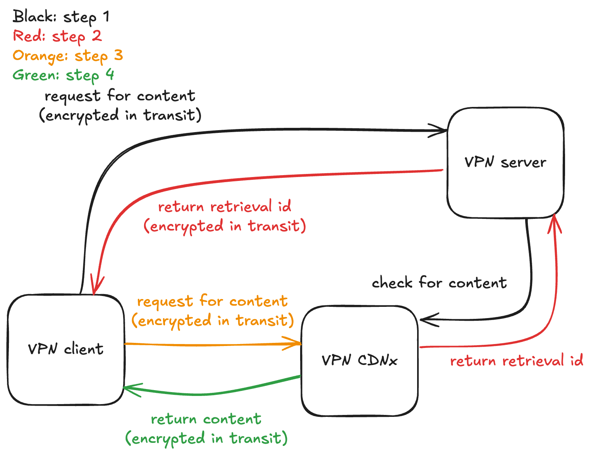
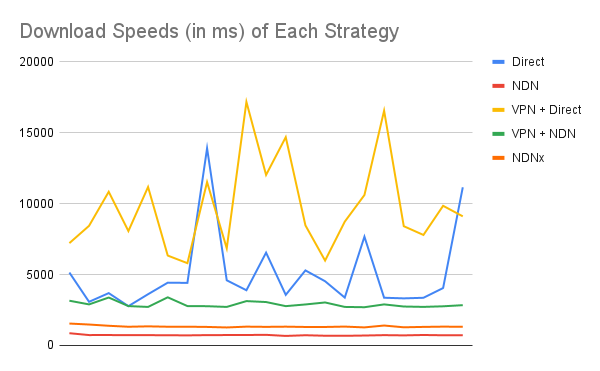

# CDNx
Using a Virtual Private Network negates the performance advantage of Content Delivery Networks. Consider the case of retrieving an asset from a CDN: at best, a VPN exit node that is geographically close to both a user and a CDN edge node will simply add a hop to a normal CDN request increasing latency. At worst, a geographically distant VPN exit node will ping to its own local CDN edge node and perform significantly worse than a normal CDN request.

Content Delivery Network eXtensions is a solution to this problem where VPN service providers can incrementally deploy their own CDN hardware so that privacy-required users can still benefit from geographically advantaged content retrieval while also maintaining end-to-end encryption of their traffic.

The core mechanic of involves a VPN service checking against an entry-node-local content key cache for whether the VPN-managed CDN contains a requested resource and what the corresponding encrypted content key for that resource is upon receiving a content request from a user device. On a cache hit, the encrypted key is sent back to the user-device using a normal e2ee VPN response message. The user device is then able to use the new content key to directly request the CDN (the encrypted content key maintains privacy of the user's traffic) to retrieve an encrypted copy of the asset which the device's VPN client can then unencrypt.

Fig. 1: This HLD shows the overall sequence of how the CDNx content retrieval works.

Fig. 2: flow chart for content available in CDNx cache

Fig. 3: flow chart for content that is not in the cache

# About this Repo
This repo contains the service code and infrastructure-as-code for deploying a simulation of a geographically separated user's device and a VPN server. There are endpoints available on the two servers to allow for speed testing different configurations of content retrieval: with VPN, with CDN, with both, with neither, and with CDNx.

# Results
The simulation was used to carry out an experiment about the relative download speeds of each internet strategy, visible in this chart

More information can be found in the below links:

[User Device](UserDevice.md)

[VPN Server](VPNServer.md)

[CDNx Content Cache](CDNxContentCache.md)